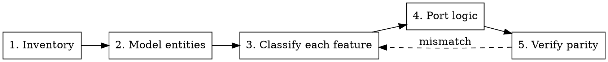
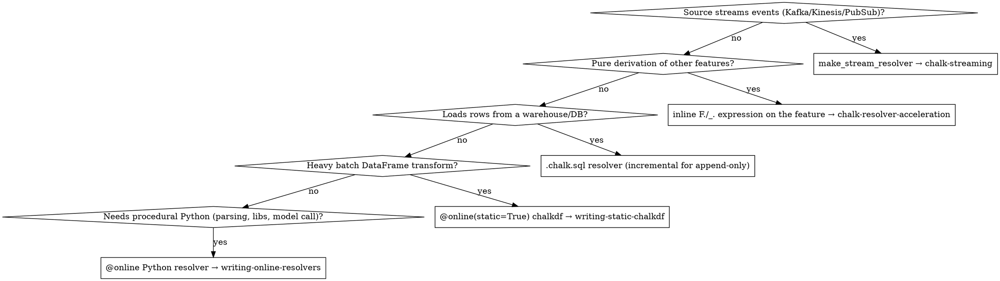

# Migrating Existing Features to Chalk

## Overview

Most ML teams already compute features — in dbt models, Prefect/Airflow-scheduled pandas jobs, Spark pipelines, or a feature store like Feast/Tecton. Migrating to Chalk is **not** a line-by-line code translation. It's a re-modeling: you describe *what* each feature is and *how to compute one* (a resolver), and Chalk owns the *when* (scheduling, materialization, caching, point-in-time replay) that your old stack hand-rolled.

**The core mental shift:**

| Legacy stack | Chalk |
|---|---|
| A job writes a feature **table** on a schedule (dbt run, Prefect flow, Spark job) | A **resolver** computes a feature value; Chalk schedules/materializes it |
| Online/serving features re-implemented separately from training → **train-serve skew** | One resolver serves both online and offline (backtest) queries |
| Point-in-time correctness done by hand (`asof` joins, snapshot tables) | `Now` + offline query replay give it for free |
| Orchestration (Prefect/Airflow DAG) is code you maintain | **Dropped** — Chalk is the scheduler |

This skill owns the migration-specific work: inventory, entity modeling, construct selection, and **parity verification**. It does **not** re-teach resolver mechanics — it hands off to the skill that owns each construct (see [Handoffs](#handoffs)).

## When to Use

- Converting dbt models / `.sql` feature definitions into Chalk
- Porting Prefect- or Airflow-orchestrated pandas/Python feature pipelines
- Migrating Spark/PySpark batch feature jobs
- Mapping a Feast / Tecton feature store (entities, feature views, on-demand transforms) onto Chalk
- Standing up online serving for features that today only exist as offline/training tables
- Killing train-serve skew between a training pipeline and a separate serving path

## The Migration Workflow



### 1. Inventory the existing features

Before writing any Chalk code, build a table of what exists. For each feature (or feature view / dbt column / pipeline output) capture:

| Column | Why it matters |
|---|---|
| **Source artifact** | dbt model, Prefect flow + task, Spark job, Feast feature view |
| **Entity / grain** | What is one row keyed by? (user, transaction, account+day) → becomes the Chalk primary key |
| **Inputs** | Upstream tables/columns/features it reads → becomes resolver inputs / relationships |
| **Computation** | SQL aggregation, pandas transform, UDF, model inference |
| **Freshness** | Batch daily? Hourly? Real-time? → drives resolver type + `max_staleness` |
| **Online vs offline use** | Served at inference, used only in training, or both |
| **Point-in-time semantics** | Does it use an `asof`/event-time join today, or just "latest"? → must be preserved |

For dbt, `manifest.json` + `catalog.json` enumerate models, columns, and lineage. For Feast/Tecton, the `FeatureView`/`Entity` definitions are already declarative — they map almost one-to-one. For Prefect/Airflow, read the DAG to find which tasks *produce features* vs. which only *move data* (the latter usually disappear — Chalk handles ingestion).

### 2. Model entities → feature classes

The grain of your legacy tables becomes Chalk **feature classes** with primary keys. Relationships you express today as SQL joins become Chalk relationships (dotted-path access), not repeated joins in every resolver.

```python
from chalk.features import features, DataFrame, Primary
from datetime import datetime

@features
class User:
    id: str
    # scalar features land here

@features
class Transaction:
    id: str
    user_id: "User.id"            # FK → implicit join
    amount: float
    created_at: datetime

@features
class User:                       # has-many back-reference
    transactions: DataFrame[Transaction]
```

- **Feast/Tecton entities → feature classes**; their join keys → `Primary[...]` or FK annotations.
- **dbt grain (the `unique_key`)** → the primary key.
- A SQL `JOIN users ON ...` repeated across models → model the relationship **once**; resolvers read `Transaction.user.signup_date` via the dotted path.
- See `BASE_CHALK_PROMPT.md` for has-one / has-many / forward-reference / circular-import syntax.

### 3. Classify each feature → pick the Chalk construct

This is the decision that determines which handoff skill you use. Walk each inventoried feature through:



**Prefer expressions and SQL resolvers over Python.** A dbt `SUM(amount) GROUP BY user` is usually *not* a Python resolver in Chalk — it's a `_.transactions[_.amount].sum()` expression or a windowed aggregation, which the engine computes natively. Reach for Python only for genuinely procedural logic.

### 4. Port the logic

Translate the computation into the chosen construct, **preserving grain and as-of semantics**. Don't copy the orchestration — there is no DAG, no schedule glue, no "write to table" step. A feature is defined once and computed on demand (or materialized by Chalk).

Follow the construct's owning skill for mechanics. Common source → Chalk shapes:

```python
# dbt:  SELECT user_id, SUM(amount) AS total_spent FROM txns GROUP BY 1
# Chalk: an expression on the feature class — no resolver, no schedule
@features
class User:
    transactions: DataFrame[Transaction]
    total_spent: float = _.transactions[_.amount].sum()

# dbt rolling window (txns in last 7/30d) → windowed() aggregation.
# `_.chalk_window` = window start, `_.chalk_now` = query time (see BASE_CHALK_PROMPT.md → Windowed Aggregations).
# CRITICAL: match the source's boundary inclusivity. dbt `>= dateadd(...)` / BETWEEN is INCLUSIVE and
# often anchored to date_trunc(current_date), not the request instant — so `>` here would silently drop
# rows. Use `>=`/`<=` and the right anchor to match the legacy SQL, then confirm in the parity diff.
    spend: Windowed[float] = windowed(
        "1d", "7d", "30d",
        expression=_.transactions[
            _.amount, _.created_at >= _.chalk_window, _.created_at < _.chalk_now
        ].sum(),
        default=0,
    )

# Feast on-demand feature view (Python transform at request time) → @online resolver
# Spark batch agg over a parquet table → @online(static=True) chalkdf (scan + groupby)
# Prefect task that POSTs to a model service → F.http_post expression + small parse resolver
```

### 5. Verify parity (do not skip)

A migration is correct only when Chalk produces the **same values** the legacy stack did — and crucially, the same values *as of the right point in time*. This is where silent train-serve skew hides.

1. **Pick a sample of entity keys** with known legacy outputs (a slice of the dbt table / training set).
2. **Run an offline query** with `recompute_features=True` and `now=` set to the timestamp the legacy value was computed for:
   ```python
   dataset = client.offline_query(
       input={User.id: sample_ids},
       output=[User.total_spent, User.spend["7d"]],
       recompute_features=True,           # force recompute for point-in-time correctness
   )
   df = dataset.to_pandas()
   ```
3. **Diff against the legacy table** on the same keys + timestamps. Investigate every mismatch — don't write it off as rounding.
4. **Watch the usual skew sources:** null handling and divide-by-zero (`inf`/`NaN`), `latest` vs. event-time (`asof`) joins, timezone-naive vs. aware timestamps, empty-collection defaults, float vs. int, dedup/ordering, and window-boundary inclusivity (`>` vs `>=`).

**Some legacy outputs are not reproducible** — a versioned external model/API, randomness, or wall-clock-dependent logic won't recompute to the historically-served value, and chasing that diff is futile. For these, **don't recompute**: ingest the historical values as a feature (offline load / `chalk upload`) keyed by entity + timestamp, or pin the model version, rather than recomputing in a resolver.

Parity discipline is the same as in `chalk-resolver-acceleration` §6 — compare against the *current* legacy run, not a stale snapshot, especially when upstream data drifts.

## Source-System Mapping Reference

| Legacy construct | Chalk construct | Notes |
|---|---|---|
| dbt model (`SELECT … GROUP BY`) | inline expression or windowed aggregation | Aggregations rarely need Python; let the engine compute them |
| dbt model that *loads* raw rows | `.chalk.sql` resolver | Drop the `.chalk.sql` file in `src/resolvers/sql/`; Chalk auto-discovers it |
| dbt **incremental** model (append-only) | `.chalk.sql` with `-- incremental:` block, or a stream resolver | Use the `incremental_column` + `lookback_period` for late data |
| dbt `ref()` join chain | Chalk relationship (FK / has-many) | Model the join **once**; access via dotted path |
| Prefect/Airflow task: pandas transform | `@online` resolver or expression | The task body → resolver logic; the scheduling → **dropped** |
| Prefect/Airflow task: extract/load data | usually **deleted** | Chalk ingests from the source directly (SQL/stream resolver) |
| Prefect/Airflow DAG dependencies | implicit in Chalk's feature graph | Don't recreate the DAG; declare inputs and Chalk orders execution |
| Spark batch aggregation over a table | `@online(static=True)` chalkdf | `scan(parquet) → group_by → agg`; see `writing-static-chalkdf` |
| Spark/warehouse reference-data join | reference feature class + join | Don't load a dict at import — model the lookup table as features |
| Feast `Entity` | feature class + primary key | Join keys → `Primary[...]` / FK annotations |
| Feast/Tecton `FeatureView` (batch) | feature class + SQL/static resolver | Batch source → SQL or `static=True` resolver |
| Feast `OnDemandFeatureView` (request-time Python) | `@online` resolver (or expression) | The transform runs at query time, same as on-demand |
| Tecton `StreamFeatureView` | `make_stream_resolver` | See `chalk-streaming` |
| Materialized/precomputed serving table | feature with `max_staleness` (+ `materialization` for windows) | Let Chalk cache; you stop maintaining the table |
| Scoring step — **external** HTTP/gRPC model service | `F.http_post`/`F.http_get` expression + small parse resolver | The model stays remote; Chalk only calls it. See `writing-online-resolvers` → Feature Expressions |
| Scoring step — model **artifact** you can register in Chalk | `make_model_resolver` + model registry | Use only when the model can live in Chalk's registry. See `BASE_CHALK_PROMPT.md` → Model Registry |

## Migration Gotchas

| Gotcha | Why it bites | Fix |
|---|---|---|
| **Don't port the orchestration** | Recreating the Prefect/Airflow DAG as resolvers wastes effort and fights Chalk | Declare inputs/relationships; Chalk schedules and orders compute |
| **`latest` ≠ point-in-time** | Legacy serving often reads the newest row; training used an `asof` join. Porting both as "latest" reintroduces skew | Use event-time fields + `Now`; verify with an offline `now=` query |
| **Entity-key mismatch** | dbt grain or Feast join key doesn't match the Chalk primary key (composite vs single) | Align primary keys in step 2 *before* writing resolvers |
| **Re-implementing aggregations in Python** | A `GROUP BY` ported as a Python loop is slow and may not accelerate | Use `_.children[...].sum()` / `windowed()` expressions |
| **Window boundary drift** | dbt `BETWEEN` is inclusive; an expression filter may be `>` exclusive | Match `>=`/`>` and `<`/`<=` exactly; check the parity diff |
| **Importing a lookup dict/CSV at module load** | Won't accelerate and breaks in the engine | Model reference data as a feature class and join (see `chalk-resolver-acceleration` §3.4) |
| **One-shot full migration** | Big-bang ports are hard to validate | Migrate one entity/feature-group at a time; run both stacks in parallel and diff until trusted |
| **Freshness left implicit** | Legacy daily batch had natural staleness; Chalk recomputes unless told otherwise | Set `max_staleness` to match the old cadence where appropriate |

## Handoffs

Once you've classified a feature (step 3), the mechanics live in these skills — use them rather than re-deriving:

- **`writing-online-resolvers`** — `@online` Python resolver signatures, `Now`, dotted paths, has-many aggregation, testing
- **`writing-static-chalkdf`** — `@online(static=True)` chalkdf for batch/Spark-style DataFrame transforms
- **`chalk-streaming`** — `make_stream_resolver` for Kafka/Kinesis/PubSub sources
- **`chalk-resolver-acceleration`** — pushing logic into inline `F.`/`_.` expressions and proving output parity
- **`BASE_CHALK_PROMPT.md`** — feature-class syntax, relationships, SQL resolvers, windowed aggregations, model registry, queries

## Further reading

- https://docs.chalk.ai/llms.txt — core concepts, optimized for AI assistants
- https://docs.chalk.ai/llms-full.txt — comprehensive docs reference
